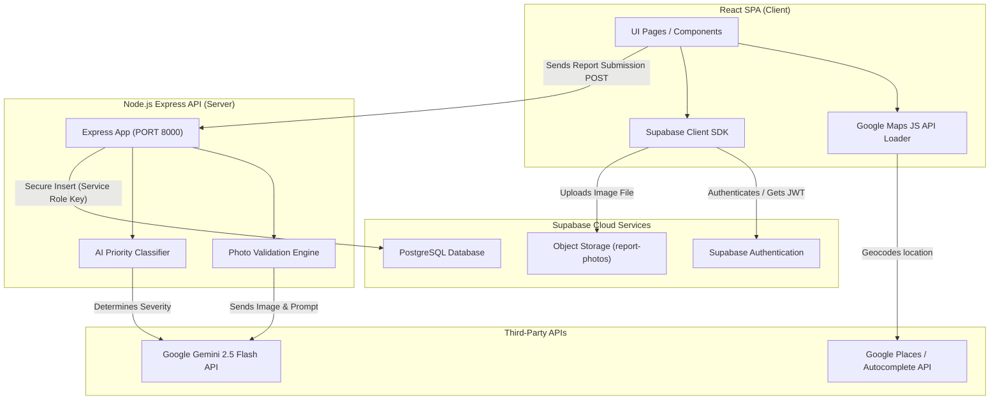
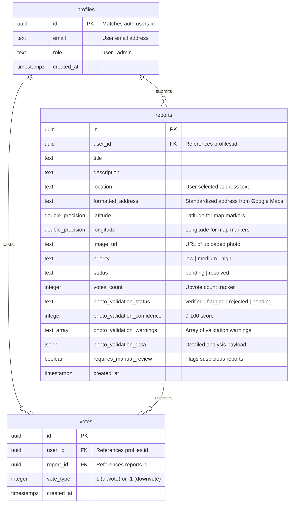

# Civic Sense AI 🏙️

[](LICENSE)
[](backend/__tests__)
[](https://nodejs.org/)
[](https://supabase.com)
[](https://deepmind.google/technologies/gemini/)

**Civic Sense AI** is a modern, AI-powered civic engagement and infrastructure reporting platform. It empowers citizens to report local civic issues (such as potholes, broken streetlights, or illegal dumping) while integrating a multi-layered verification engine to audit report authenticity, filter out spam or edited images, and automatically categorize report priority.

By combining precise Google Maps coordinate tracking, digital forensics image heuristics, and LLM-powered verification, Civic Sense AI bridges the gap between community complaints and administrative action.

---

## 🛠️ System Architecture

Civic Sense AI is built using a decoupled client-server architecture designed for reliability, fast parallel processing, and resilience against external API failures.



---

## 🧠 AI & Verification Engine Design

The core technical differentiator of Civic Sense AI is its **Multi-Layered Verification Engine** located at [`backend/routes/photoValidation.js`](backend/routes/photoValidation.js). Instead of blindly calling a generative AI API, the platform uses a hybrid pipeline combining deterministic image analysis, spatial metadata geofencing, and LLM semantic validation running in parallel.

### 1. Model/Provider Architecture

- **Model Selected**: `gemini-2.5-flash`
- **Rationale**:
  1.  **Multimodal Inputs**: Gemini 2.5 Flash possesses native vision processing capabilities, enabling it to analyze base64 image streams directly beside textual cues.
  2.  **Structural Integrity**: It supports `responseMimeType: "application/json"`, which allows us to enforce strict JSON schemas directly from the inference engine and eliminate parsing errors.
  3.  **Low Latency & High Rate Limits**: Flash has an average time-to-first-token under 200ms, making it suitable for inline user-facing submission pipelines.
- **Parallel Execution**: To minimize latency, the backend calls all validation sub-routines (EXIF checks, image processing filters, and Gemini vision analysis) concurrently using `Promise.all()`. This guarantees verification completes in under 3 seconds.

---

### 2. Prompt Engineering & JSON Constraints

The system relies on structured prompts instructing Gemini to act as a civic auditor, returning parseable data under strict schema guidelines.

#### Content Match Prompt

This prompt validates that the photo actually matches what the user is reporting, identifying spoofing or unrelated images.

```javascript
const prompt = `You are a civic issue verification expert. Analyze this image and determine if it matches the reported issue.

**Report Title:** ${title}
**Report Description:** ${description}

**Your Task:**
1. Describe what you see in the image in detail
2. Determine if the image content matches the reported civic issue
3. Identify any inconsistencies or red flags
4. Rate the match confidence from 0-100

**Response Format (JSON only):**
{
  "imageDescription": "detailed description of what you see",
  "matchConfidence": 85,
  "reasoning": "why it matches or doesn't match",
  "inconsistencies": ["list any red flags"],
  "suggestedCategory": "pothole|streetlight|garbage|drainage|other"
}`;
```

#### Priority Categorization Prompt

This prompt calculates issue priority level based on text severity.

```javascript
const prompt = `You are an AI assistant for a civic reporting app.
Given the following report from a citizen, determine the priority level of the issue.
Respond ONLY with one of the following words: "high", "medium", or "low".

Title: ${title}
Description: ${description}`;
```

---

### 3. Evaluation & Thresholding Strategy

Verification results are merged via a weighted scoring function [`backend/utils/validation.js`](backend/utils/validation.js#L115):

| Validation Channel                   | Weight  | Metric Evaluated                                                           |
| :----------------------------------- | :-----: | :------------------------------------------------------------------------- |
| **Content Match (Gemini Vision)**    | **50%** | Semantic match confidence (0-100) between user text and photo.             |
| **Authenticity (Digital Forensics)** | **30%** | Image heuristics (compression artifacts, color variance, edge complexity). |
| **Metadata Verification (EXIF)**     | **10%** | Presence of camera metadata, timestamps, and geolocation tags.             |
| **Issue Classification (Gemini)**    | **10%** | Match between predicted issue type and reported category.                  |

#### Outcome Thresholds

- **Confidence $\ge$ 70%** and $\le$ 2 Warnings $\implies$ **`VERIFIED`** (Auto-accept, publish directly).
- **Confidence 40% - 69%** or $> 2$ Warnings $\implies$ **`FLAGGED_FOR_REVIEW`** (Accept, but flag in Database for manual admin override).
- **Confidence $<$ 40%** $\implies$ **`REJECTED`** (Block submission, show descriptive user error).

---

## ⚖️ Trade-off & Risk Discussion (Disaster Management)

In public safety and civic infrastructure applications, setting validation tolerances involves trade-offs. The table below outlines how Civic Sense AI balances **False Positives** vs. **False Negatives**:

| Metric                   | Threat Definition                                                                     | Real-World Impact                                                                                                                                                      | Civic Sense Mitigation                                                                                                                                                                                                                                                                                                                                          |
| :----------------------- | :------------------------------------------------------------------------------------ | :--------------------------------------------------------------------------------------------------------------------------------------------------------------------- | :-------------------------------------------------------------------------------------------------------------------------------------------------------------------------------------------------------------------------------------------------------------------------------------------------------------------------------------------------------------- |
| **False Positives (FP)** | An invalid, fake, or recycled photo is accepted as a real, active emergency issue.    | Municipal resources (crews, vehicles) are dispatched to non-existent incidents, wasting taxpayer funds and delaying responses to actual crises (e.g. fire/live wires). | 1. **Digital Forensics**: Sharp runs noise filters and edge-convolution algorithms to detect CGI or extreme Photoshop edits.<br>2. **EXIF Bounds Checking**: GPS coordinate tags are geofenced against India's coordinates to reject out-of-region images.                                                                                                      |
| **False Negatives (FN)** | A real, high-severity civic hazard is classified as fake or low-priority and blocked. | Critical hazards (broken gas lines, structural collapses, active flooding) remain unaddressed. Public safety is compromised and citizen trust declines.                | 1. **Fail-Open Strategy**: If Gemini API keys expire, are rate-limited, or throw a 500 error, the engine defaults the content score to 50% and flags it for review rather than rejecting it.<br>2. **Human-in-the-Loop Override**: A separate admin moderation queue stores flagged submissions, ensuring a city clerk review can override automated decisions. |

---

## 📋 Database Schema



---

## 🛠️ Resiliency & Error Handling

To achieve the Non-Functional Requirements (NFR-03) of high system availability, the codebase implements structured boundaries for failure recovery:

1.  **Vision AI Recovery**: The `validateContentMatch` routine catches JSON parsing errors and API rate limits. Instead of crashing, it returns `passed: true` (to avoid blocking the citizen) with a confidence of `50` and a warning tag `"AI content validation unavailable"`.
2.  **EXIF Fallbacks**: The `exif-parser` only reads JPEG metadata. If a user uploads a PNG or a screenshot, the parser throws an error. The backend catches this, and downgrades metadata confidence to `40` without blocking submission.
3.  **Client-Side Toast Notifications**: The frontend uses `sonner` to toast clean messages explaining validation status to users (e.g. telling them the photo is flagged due to metadata inconsistencies, rather than throwing raw HTTP status errors).

---

## 🧪 Unit Testing

We maintain a Jest unit testing suite covering our top 3 logical components:

1.  **AI Priority Scoring (`backend/utils/ai.js`)**: Tests keyword triggers, vote calculations, and time-based priority inflation.
2.  **EXIF Coordinate Geofencing (`backend/utils/validation.js`)**: Tests coordinates against geographical borders of India.
3.  **Verification Merging Heuristics (`backend/utils/validation.js`)**: Simulates scoring combinations to verify state machines.

### Run Tests

To run backend unit tests from the root directory:

```bash
npm test
```

To run formatting checks:

```bash
npm run format
```

---

## ⚙️ Development Setup

### Prerequisites

- Node.js (v18 or higher)
- Supabase Account & Google Maps API key
- Gemini API key (available on Google AI Studio)

### Installation

1.  **Clone the repository**:

    ```bash
    git clone https://github.com/Krishnak8080/CivicSenseAI.git
    cd CivicSenseAI
    ```

2.  **Install dependencies**:

    ```bash
    npm install
    ```

3.  **Environment Variables**:
    - Copy the root [`.env.example`](.env.example) structure.
    - Create `frontend/.env.local` with frontend keys.
    - Create `backend/.env` with backend keys.

4.  **Database Migration**:
    - Run the SQL scripts in [`supabase/schema.sql`](supabase/schema.sql) and migrations inside your Supabase project SQL Editor.

5.  **Run Dev Servers**:
    ```bash
    npm start
    ```
    - Frontend runs at `http://localhost:5173`
    - Backend runs at `http://localhost:8000`
