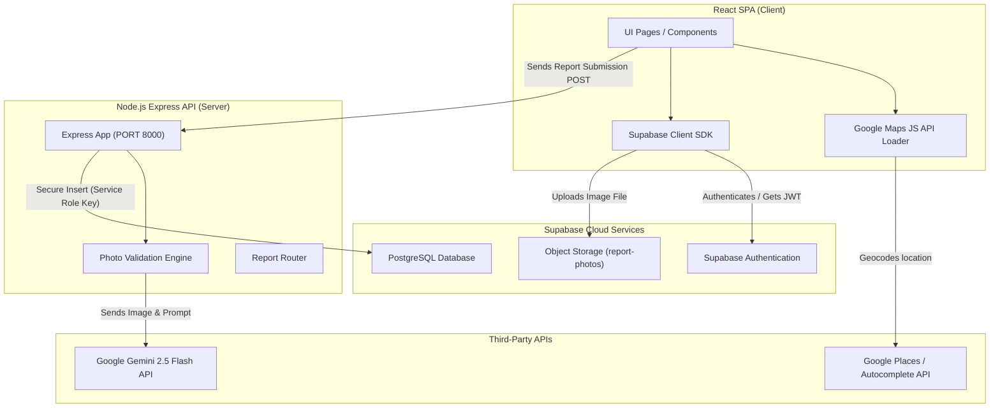
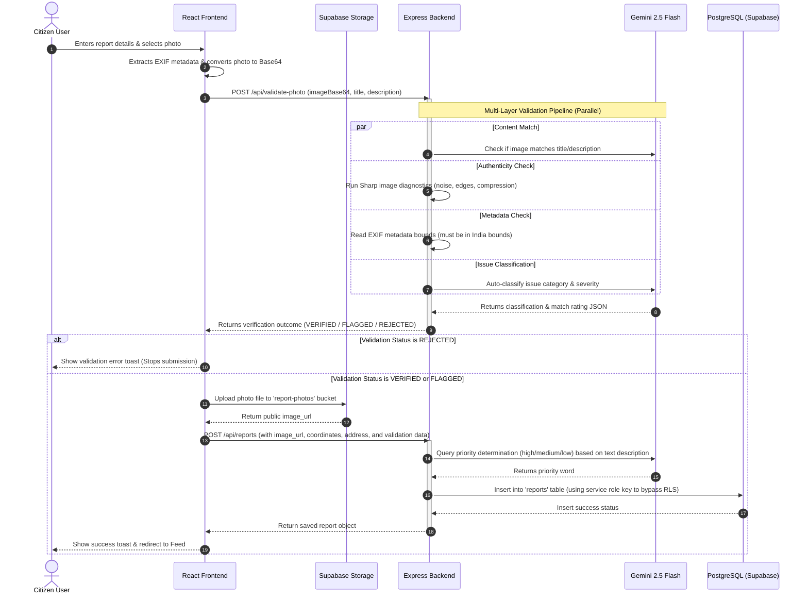
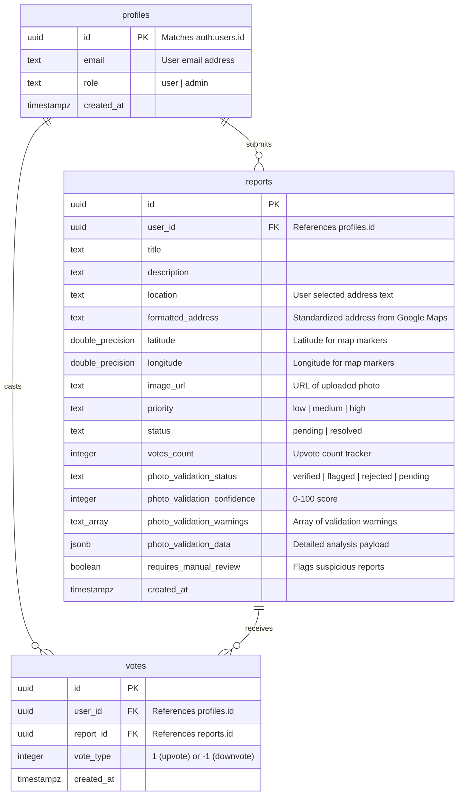

# Civic Sense AI - System Architecture & Technical Documentation

This document explains the architecture, data flow, database design, and key subsystems of **Civic Sense AI**, a full-stack AI-powered civic reporting and verification platform.

---

## 1. System Architecture Overview

Civic Sense AI is built using a decoupled client-server architecture consisting of three main tiers: the React Frontend SPA, the Node.js/Express API Backend, and the Supabase Cloud Backend (database, auth, and object storage).



---

## 2. Core Subsystems

### A. Frontend Single-Page Application (React & TypeScript)

- **Vite Development Server:** Hosts the client on `http://localhost:5173`.
- **Google Maps Integration:** Utilizes `@googlemaps/js-api-loader` to load Google Maps dynamically. The maps display report locations with custom SVG markers color-coded by priority.
- **Form Wizard:** The `ReportForm.tsx` component guides users through submitting a title, description, locating the issue on the map, and uploading a photo.

### B. Node.js & Express API Backend

- **Server Entrypoint:** Runs on `http://localhost:8000` via `backend/server.js`.
- **Gemini priority classifier:** Classifies civic reports dynamically based on description severity (High, Medium, Low).
- **Photo Validation Engine (`backend/routes/photoValidation.js`):** Performs multi-layered validation on uploaded photos to detect mismatches, deepfakes, and coordinate checks.

### C. Database & Storage Layer (Supabase / PostgreSQL)

- **Relational Database:** Houses PostgreSQL tables (`profiles`, `reports`, `votes`) with RLS policy controls.
- **Supabase Storage:** Hosts a public bucket named `report-photos` where uploaded photos are stored.

---

## 3. Data Flow Diagram: Report Submission & Verification

The sequence diagram below shows how a citizen report goes through validation, AI priority analysis, and database insertion.



---

## 4. Database Schema & Relationships



### PostgreSQL Functions & Triggers (Supabase)

To ensure the social feed remains fast and upvotes are consistent, we utilize an active database trigger that calculates upvotes:

```sql
CREATE OR REPLACE FUNCTION handle_vote_change()
RETURNS trigger AS $$
BEGIN
  IF TG_OP = 'INSERT' THEN
    UPDATE reports SET votes_count = votes_count + NEW.vote_type WHERE id = NEW.report_id;
    RETURN NEW;
  ELSIF TG_OP = 'DELETE' THEN
    UPDATE reports SET votes_count = votes_count - OLD.vote_type WHERE id = OLD.report_id;
    RETURN OLD;
  ELSIF TG_OP = 'UPDATE' THEN
    UPDATE reports SET votes_count = votes_count - OLD.vote_type + NEW.vote_type WHERE id = NEW.report_id;
    RETURN NEW;
  END IF;
  RETURN NULL;
END;
$$ LANGUAGE plpgsql SECURITY DEFINER;

CREATE TRIGGER on_vote_change
AFTER INSERT OR UPDATE OR DELETE ON votes
FOR EACH ROW EXECUTE FUNCTION handle_vote_change();
```

---

## 5. Main APIs & Endpoints

| Endpoint                | Method | Description                                                                           | Input                                                                                                           | Output                                                                                    |
| ----------------------- | ------ | ------------------------------------------------------------------------------------- | --------------------------------------------------------------------------------------------------------------- | ----------------------------------------------------------------------------------------- |
| `/api/validate-photo`   | `POST` | Processes Base64 image data through the multi-layered verification pipeline.          | `{ imageBase64, description, title }`                                                                           | `{ status, overallConfidence, warnings, recommendation, validations }`                    |
| `/api/reports`          | `POST` | Creates a new report after running AI Priority classification and saving to Postgres. | `{ title, description, photo_url, latitude, longitude, address, formatted_address, user_id, photo_validation }` | `{ id, title, description, latitude, longitude, priority, photo_validation_status, ... }` |
| `/api/analyze-priority` | `POST` | Analyzes a title and description, returning an issue severity classification.         | `{ title, description }`                                                                                        | `{ priority }`                                                                            |
