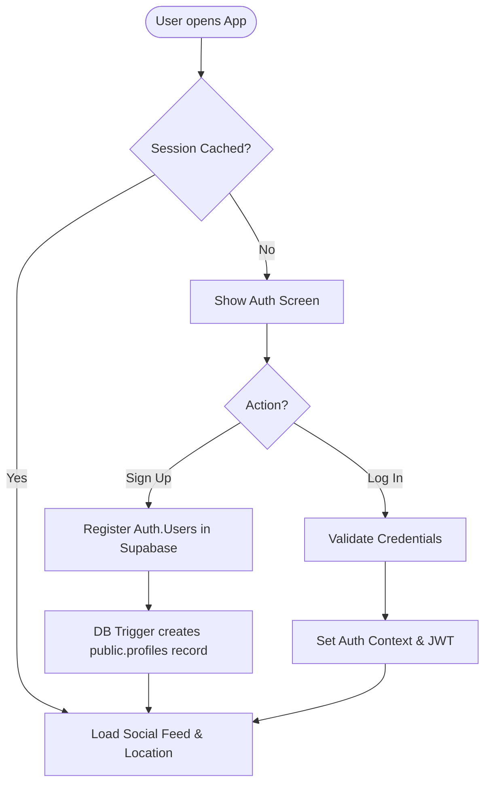
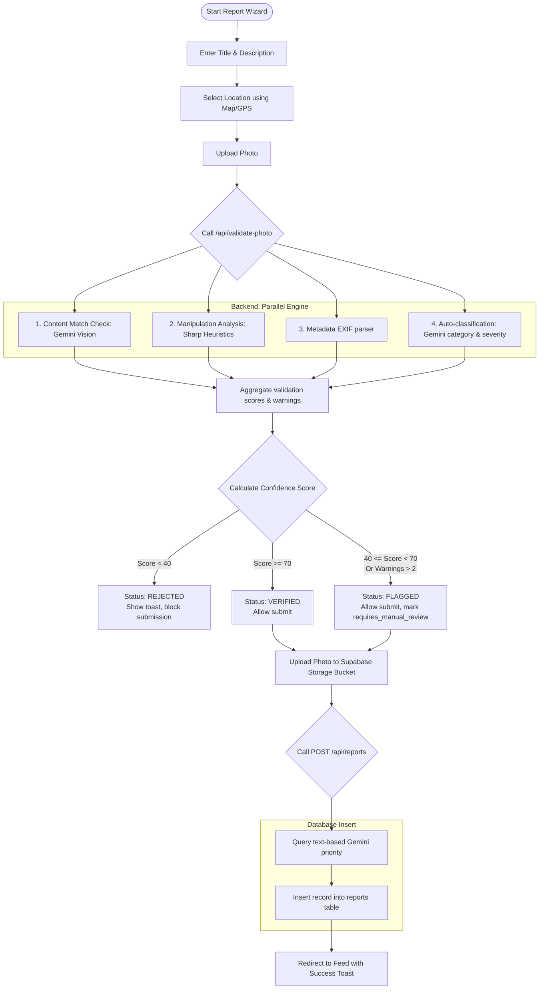
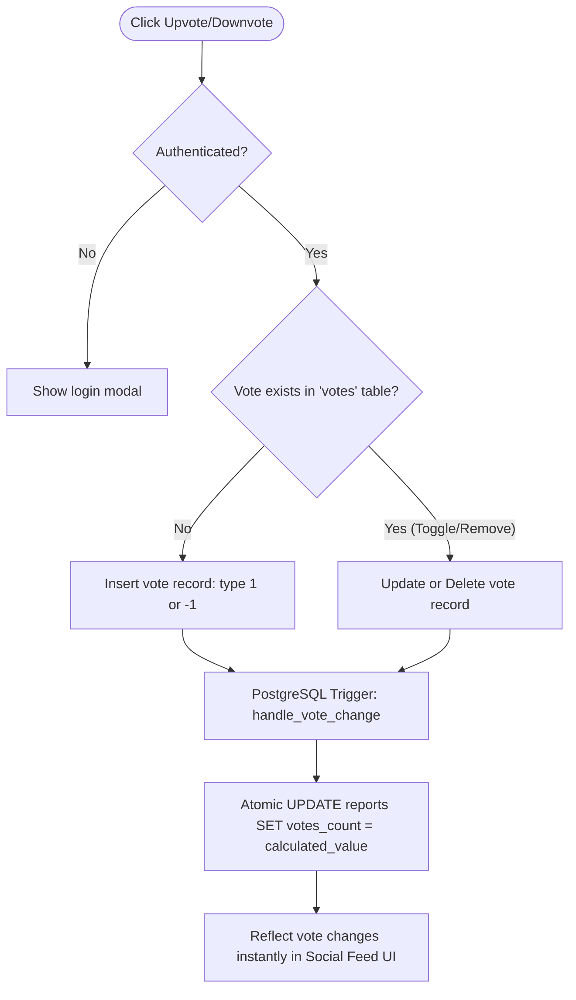
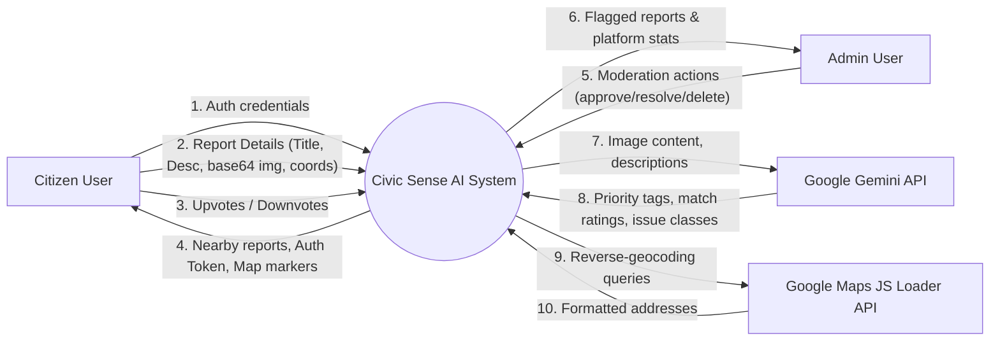
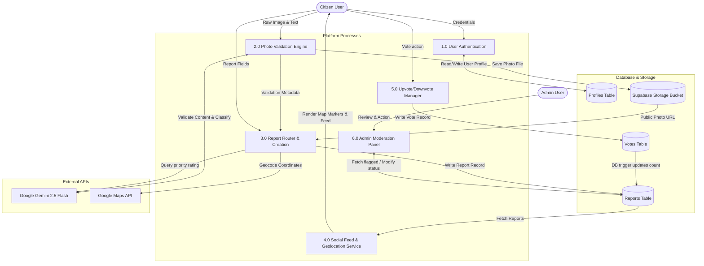
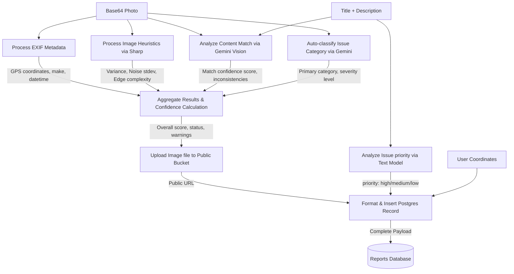
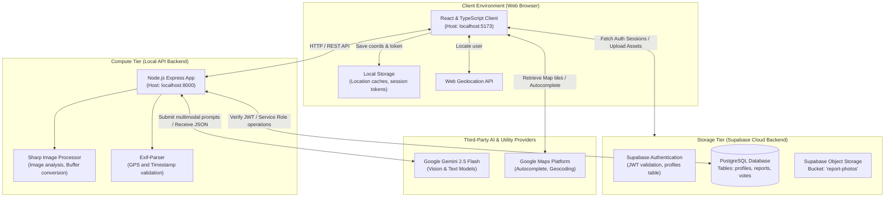

# Civic Sense AI - Technical Specification & Architecture Documentation

This document provides a comprehensive breakdown of the functional specifications, system flows, architecture, database schemas, and critical code patterns of the **Civic Sense AI** platform.

---

## 1. Software Requirements Specification (SRS)

### 1.1 Purpose

Civic Sense AI is a platform designed to bridge the gap between citizens and local government authorities. It allows citizens to report local civic issues (such as potholes, malfunctioning streetlights, overflowing garbage, and waterlogging) while using a multi-layered verification system to confirm report authenticity and calculate priority levels.

### 1.2 Scope

- **Web Application Client**: React/TypeScript Single Page Application utilizing a modern dark-mode UI, Google Maps, and interactive map pins.
- **Node.js Express Backend API**: A validation and routing server communicating with generative AI models and handling image manipulations.
- **Supabase Cloud Backend**: PostgreSQL database with Row-Level Security (RLS) policies, authentication sessions, and object storage for report media.
- **AI Integrations**: Gemini 2.5 Flash for image content checking and text analysis, and Google Places/Geocoding API for spatial mapping.

### 1.3 User Roles

1. **Citizen (User)**: Can sign up, log in, view nearby reports on a map/feed, submit new reports with photos, and vote on reports.
2. **Administrator (Admin)**: Has access to a dedicated dashboard to audit flagged reports (images flagged as suspicious), resolve civic issues, and delete spam.

### 1.4 Functional Requirements (FR)

| Req ID    | Feature            | Description                                                            | Input                                       | Output / Outcome                                                 |
| :-------- | :----------------- | :--------------------------------------------------------------------- | :------------------------------------------ | :--------------------------------------------------------------- |
| **FR-01** | User Auth          | Secure sign-up, login, and token-based sessions via Supabase Auth.     | Email, Password                             | User profile, JSON Web Token (JWT)                               |
| **FR-02** | Wizard Form        | Multi-step form flow for creating a new civic issue report.            | Title, Description, Image file, Coordinates | Draft data ready for validation                                  |
| **FR-03** | Photo Validation   | Parallel validation checks on uploaded images.                         | Base64 image, Title, Description            | Validation score, Status (Verified, Flagged, Rejected), Warnings |
| **FR-04** | Content Matching   | Vision AI analysis to confirm the image matches the text description.  | Base64 image, Title, Description            | Content Match confidence rating (0-100)                          |
| **FR-05** | Image Manipulation | Noise, compression, and edge heuristics using Sharp.                   | Image Binary Buffer                         | Suspicion score, warnings of tampering                           |
| **FR-06** | EXIF Geolocation   | Extracts geolocation tags to verify coordinates are inside India.      | Image Binary (JPEG)                         | GPS coords, Camera Make/Model, timestamp                         |
| **FR-07** | Automated Priority | Priority classification based on issue severity using Gemini.          | Title, Description text                     | Priority Tag (`high` \| `medium` \| `low`)                       |
| **FR-08** | Interactive Map    | Map showing markers for reports, color-coded by issue priority.        | Lat/Lng coordinates                         | Custom interactive SVG icons on map                              |
| **FR-09** | Geocoding Search   | Auto-completes addresses and maps selected places to lat/lng.          | Text string query                           | Lat/Lng coordinates, formatted address                           |
| **FR-10** | Voting System      | Citizens upvote/downvote issues. Upvotes increment report weight.      | Vote action (1 or -1)                       | Real-time update of `votes_count` on report                      |
| **FR-11** | Admin Portal       | Moderation view for reports flagged as suspicious or requiring review. | Report ID, Admin action                     | Report status update (`approved` \| `rejected` \| `resolved`)    |

### 1.5 Non-Functional Requirements (NFR)

| Req ID     | Category     | Description                                                                      | Target Metric / Standard                                                                        |
| :--------- | :----------- | :------------------------------------------------------------------------------- | :---------------------------------------------------------------------------------------------- |
| **NFR-01** | Security     | Row-Level Security (RLS) on Postgres tables. Secure connection strings.          | Prevents users from updating other users' reports directly.                                     |
| **NFR-02** | Performance  | Async processing of image analysis. Feed lists cached locally.                   | Photo validation api response < 4.0 seconds (parallel execution).                               |
| **NFR-03** | Availability | Decoupled server architecture so database or AI outages don't freeze the client. | Fault-tolerant "fail-open" for AI APIs to prevent system blockages.                             |
| **NFR-04** | Accuracy     | Spatial validation of EXIF coordinates relative to India bounds.                 | Reject reports with EXIF coordinate tags pointing outside India (8.4°N-37.6°N, 68.7°E-97.25°E). |
| **NFR-05** | UI/UX        | High-contrast premium dark-themed interface, responsive design.                  | WCAG-compliant color styling, CSS backdrop-filters, smooth transitions.                         |

---

## 2. System Flow Specification (SFS)

### 2.1 Core System Flowcharts

#### A. User Onboarding & Authentication Flow

Checks credentials, provisions profile on first sign-in, and sets context.



#### B. Report Submission & Parallel Verification Flow

The user completes the wizard, submits a photo, and the backend runs metadata, content matching, and image manipulation checks in parallel.



#### C. Voting and Feedback Trigger Flow

Maintains atomic counts of upvotes and downvotes to prevent data inconsistency.



---

## 3. Data Flow Diagram (DFD)

### 3.1 DFD Level 0: Context Diagram

A high-level view showing system boundaries, external entities, and data inputs/outputs.



### 3.2 DFD Level 1: Process Decomposition

Shows major system modules, database tables, and communication channels.



### 3.3 DFD Level 2: Detailed Data Transitions for Report Submission

Focuses exclusively on how text, coordinates, binary files, and AI metadata transform step-by-step during report creation.



---

## 4. Visual System Architecture

The following diagram maps out the physical containers, environment contexts, host ports, and security levels.



---

## 5. Important Code Snippets & Purpose

The following code sections are the structural building blocks of the photo validation pipeline, category classification, geocoding logic, and relational database triggers.

### 5.1 Parallel Validation Engine (`photoValidation.js`)

**Purpose**: Uses Node's async system to run content analysis, image manipulations, GPS extraction, and auto-classification concurrently using `Promise.all`. This significantly reduces API latency, providing validation feedback under 4 seconds.

```javascript
// Located in: backend/routes/photoValidation.js
router.post('/validate-photo', async (req, res) => {
  try {
    const { imageBase64, description, title } = req.body;

    if (!imageBase64) {
      return res.status(400).json({ error: 'Image base64 is required' });
    }

    // Run all validations in parallel to optimize execution time
    const [contentMatch, authenticityCheck, metadataValidation, issueClassification] =
      await Promise.all([
        validateContentMatch(imageBase64, description, title),
        detectManipulation(imageBase64),
        validateMetadata(imageBase64),
        classifyIssueType(imageBase64),
      ]);

    // Calculate overall confidence score using weighted averages
    const validationResult = calculateConfidence({
      contentMatch,
      authenticityCheck,
      metadataValidation,
      issueClassification,
    });

    res.json(validationResult);
  } catch (error) {
    console.error('Photo validation error:', error);
    res.status(500).json({ error: 'Validation failed', message: error.message });
  }
});
```

### 5.2 Heuristic Image Diagnostics with Sharp (`photoValidation.js`)

**Purpose**: Performs mathematical analyses on the image binary (e.g., standard deviation of pixel values in noise/edge patterns) to detect computer-generated (CGI) or heavily altered images.

```javascript
// Located in: backend/routes/photoValidation.js

// 1. Noise Pattern Analysis (using Laplace convolution kernel)
async function analyzeNoisePattern(imageBuffer) {
  try {
    const noiseImage = await sharp(imageBuffer)
      .greyscale()
      .convolve({
        width: 3,
        height: 3,
        kernel: [-1, -1, -1, -1, 8, -1, -1, -1, -1], // High-pass filter for edge/noise extraction
      })
      .stats();

    const stdev = noiseImage.channels[0].stdev;
    // Natural photos always contain sensor noise. Low stdev represents CGI/uniform gradients.
    return {
      hasNaturalNoise: stdev > 0.5 && stdev < 50,
      noiseLevel: stdev,
    };
  } catch (err) {
    return { hasNaturalNoise: true, noiseLevel: 5 };
  }
}

// 2. Edge Pattern Complexity analysis (using Edge detection kernel)
async function analyzeEdgePattern(imageBuffer) {
  try {
    const edgeImage = await sharp(imageBuffer)
      .greyscale()
      .convolve({
        width: 3,
        height: 3,
        kernel: [0, 1, 0, 1, -4, 1, 0, 1, 0], // Sobel-like edge highlight
      })
      .stats();

    const stdev = edgeImage.channels[0].stdev;
    return {
      hasNaturalEdges: stdev > 2 && stdev < 80,
      edgeComplexity: stdev,
    };
  } catch (err) {
    return { hasNaturalEdges: true, edgeComplexity: 15 };
  }
}
```

### 5.3 Gemini Vision Multimodal Prompts (`photoValidation.js`)

**Purpose**: Configures Gemini 2.5 Flash to accept the base64-encoded image along with text and output structured JSON, making it easy to parse parameters safely.

```javascript
// Located in: backend/routes/photoValidation.js
async function validateContentMatch(imageBase64, description, title) {
  try {
    const model = genAI.getGenerativeModel({
      model: 'gemini-2.5-flash',
      generationConfig: { responseMimeType: 'application/json' }, // Forces output to be valid JSON
    });

    const prompt = `You are a civic issue verification expert. Analyze this image and determine if it matches the reported issue.
    **Report Title:** ${title || 'Not provided'}
    **Report Description:** ${description || 'Not provided'}
    
    Response Format (JSON only):
    {
      "imageDescription": "detailed description of what you see",
      "matchConfidence": 85,
      "reasoning": "why it matches or doesn't match",
      "inconsistencies": ["list any red flags"],
      "suggestedCategory": "pothole|streetlight|garbage|drainage|other"
    }`;

    const { mimeType, data } = getBase64Data(imageBase64);
    const imagePart = { inlineData: { data, mimeType } };

    const result = await model.generateContent([prompt, imagePart]);
    const response = await result.response;
    const analysis = JSON.parse(response.text().trim());

    return {
      passed: (analysis.matchConfidence || 0) >= 60, // Pass if matching confidence is 60% or above
      confidence: analysis.matchConfidence || 0,
      details: analysis,
      warnings: analysis.inconsistencies || [],
    };
  } catch (error) {
    console.error('Content match validation error:', error);
    return {
      passed: true,
      confidence: 50,
      details: {},
      warnings: ['AI content validation unavailable'],
    };
  }
}
```

### 5.4 Supabase Database Vote Trigger (`schema.sql` / migrations)

**Purpose**: Keeps the total upvote counts synchronized dynamically inside PostgreSQL. Every time a row is inserted, deleted, or updated in the `votes` table, the trigger runs to atomically adjust the `votes_count` in the `reports` table.

```sql
-- Located in: supabase migrations
CREATE OR REPLACE FUNCTION handle_vote_change()
RETURNS trigger AS $$
BEGIN
  IF TG_OP = 'INSERT' THEN
    UPDATE reports SET votes_count = votes_count + NEW.vote_type WHERE id = NEW.report_id;
    RETURN NEW;
  ELSIF TG_OP = 'DELETE' THEN
    UPDATE reports SET votes_count = votes_count - OLD.vote_type WHERE id = OLD.report_id;
    RETURN OLD;
  ELSIF TG_OP = 'UPDATE' THEN
    UPDATE reports SET votes_count = votes_count - OLD.vote_type + NEW.vote_type WHERE id = NEW.report_id;
    RETURN NEW;
  END IF;
  RETURN NULL;
END;
$$ LANGUAGE plpgsql SECURITY DEFINER;

CREATE TRIGGER on_vote_change
AFTER INSERT OR UPDATE OR DELETE ON votes
FOR EACH ROW EXECUTE FUNCTION handle_vote_change();
```

### 5.5 Google Maps Autocomplete & Geocoding (`LocationAutocompleteInput.tsx`)

**Purpose**: Uses the Google Maps Places SDK to handle real-time input queries, limiting autocomplete bounds to the local territory (India bounds) and returning precise latitude and longitude coordinates.

```typescript
// Located in: frontend/src/components/LocationAutocompleteInput.tsx
autocompleteRef.current = new google.maps.places.Autocomplete(inputRef.current, {
  componentRestrictions: { country: 'in' }, // Limit to India
  fields: ['formatted_address', 'geometry', 'name', 'place_id'],
  types: ['geocode', 'establishment'],
  bounds: new google.maps.LatLngBounds(
    new google.maps.LatLng(28.4089, 76.841), // South-West Delhi boundary bias
    new google.maps.LatLng(28.8836, 77.3466) // North-East Delhi boundary bias
  ),
  strictBounds: false,
});

autocompleteRef.current.addListener('place_changed', () => {
  const place = autocompleteRef.current?.getPlace();

  if (!place || !place.geometry || !place.geometry.location) {
    console.error('No details available for selected place');
    return;
  }

  const locationData: LocationData = {
    address: place.name || '',
    formatted_address: place.formatted_address || '',
    latitude: place.geometry.location.lat(),
    longitude: place.geometry.location.lng(),
    place_id: place.place_id,
  };

  onLocationSelect(locationData);
});
```
